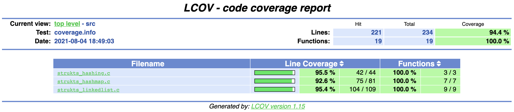

<h1 align="center">Strukts!</h1>

<p align="left">
  
  
  
</p>

<p align="center"></p>

## Table of Contents

- [Strukts](#Strukts)
  - [Objective](#Objective)
  - [Code Quality And Memory Safety](#Code-Quality-And-Memory-Safety)
  - [Requirements](#Requirements)
  - [Dependencies](#Dependencies)
- [Compiling Strukts](#Compiling-Strukts)
- [Compiling Tests](#Compiling-Tests)
- [Compiling Tests with Coverage Metrics](#Compiling-Tests-with-Coverage-Metrics)

## Strukts

### Objective

Strukts is a C library with a few useful data structures/algorithms that can be reused in other C projects. It's main distribution contains a static lib, `libstrukts.a`, that can be statically linked to other C projects with an object linker such as the GNU linker [ld](https://ftp.gnu.org/old-gnu/Manuals/ld-2.9.1/html_mono/ld.html).

Finally, this project is a training ground for exercising some classical algorithms and data structures implementations.

### Code Quality and Memory Safety

Strukts's CICD pipeline builds the project, and its tests, together with SonarCloud in order to generate this repo's badges to assert its quality, safety, maintainability, test coverage metrics, etc. Hence, the badges show the overall project's "health"!

Also, Strukts uses an external lib called [safemalloc](https://github.com/Theldus/safemalloc) that is used to provide some degree of memory safety as `safemalloc` warns, during tests, if there are memory leaks (memory that should have been deallocated but was not) and other memory problems.

As an example, if we comment out the last `free()` invocation inside the function [strukts_linkedlist_free](src/strukts_linkedlist.c) that is responsible for releasing all the allocated heap memory of a linked list, then once we run the tests we should see the following warning:

```sh
Memory leaks were found during execution, please check below and fix.
----------------------------------------------------------------------
- Address 0x7fdabfc064e0 (16 bytes) not freed!
  -> Allocated at [.../src/strukts_linkedlist.c:13] strukts_linkedlist_new()
```

Which is very useful to make sure that implementations are handling memory management in a proper way.

### Requirements

In order to compile Strukts and its tests, it's necessary to have:

- C compiler such as `gcc`, `clang`, etc.
- CMake for building the projects
- C++ compiler such as `g++`, `clang`, etc. (tests only)
- `gcov`, `lcov` and `genhtml` (code coverage metrics only)

### Dependencies

Strukts depends on the following third-party libraries:

- [safemalloc](https://github.com/Theldus/safemalloc) for memory safety (warnings about memory leaks, etc.)
- [googletest](https://github.com/google/googletest) library for running tests

Don't worry: this repo's CMake file downloads, compiles and links these dependencies automatically when building the lib and its tests.

## Compiling Strukts

First, clone this repo and create a build folder inside the cloned repo folder:

```sh
make build && cd build
```

Then, compile the project with `CMake`:

```sh
cmake .. && make
```

After this, the compiled static library will be at `build/lib/libstrukts.a`. This file can be statically linked
to your C project. Moreover, in order to use Struks's functions definitions, the library headers can be found at the repo's [include](include/strukts) folder.

## Compiling Tests

First, clone this repo and create a build folder inside the cloned folder:

```sh
mkdir build && cd build
```

Then, build the project with `CMake` with the flag `-DWITH_TEST=ON` which will fetch/compile/link the projects dependencies such as the [GoogleTest/GoogleMock](https://github.com/google/googletest) and finally compile and run
the tests:

```sh
cmake -DWITH_TEST=ON .. && make test
```

The test binaries can be found at `build/bin/test` which can be used to rerun the tests if there are no code changes.

`PS`: When any piece of code changes, running the aforementioned command will compile and run the tests again without
downloading external dependencies (faster).

## Compiling Tests with Coverage Metrics

The compilation of tests with `CMake` automatically builds the project and its tests with debug symbols which allows code coverage metrics to be calculated (the coverage badge of this repo uses `*.gcov` coverage files created when the CICD pipeline is triggered). However, developers may also want to see coverage metrics on their machines. For this purpose, the [run-tests.sh](scripts/run-tests.sh) shell script was developed! It requires the following programs:

- `gcov`
- `lcov`
- `genhtml`

The shell script will use these programs to generate coverage metrics and to create a developer-friendly html page with coverage metrics such as the one shown below:



To use the script, just start an interactive bash session at the root of this repo and run the following command:

```sh
./scripts/run-tests.sh  # requires file permission to be +x at least (executable)
```

The script will compile and run tests with `CMake` and use the mentioned tools to create a `build/coverage` folder inside this repo's folder with an `index.html` that can be opened to show the developer-friendly coverage metrics.
