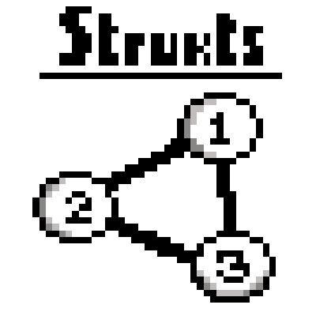

# strukts

Data struktures and algorithms implemented in C.



## Compiling the statically linked library

First, clone this repo and create a build folder inside the cloned folder

```sh
make build && cd build
```

Then, compile the project with `CMake`:

```sh
cmake .. && make
```

The compiled static library can be found in `./build/lib/libstrukts.a`. After that:

- This static lib can be linked to your own project;
- The headers of this lib can be found at `include/strukts`

## Compiling and running tests

First, clone this repo and create a build folder inside the cloned folder

```sh
mkdir build && cd build
```

Then, build the project with `CMake` with the flag `-DWITH_TEST=ON` which will fetch/compile/link the projects dependencies such as the [GoogleTest/GoogleMock](https://github.com/google/googletest) and finally compile and run
the tests:

```sh
cmake -DWITH_TEST=ON .. && make test
```

The test binaries can be found in `./build/bin/test` which can be used to rerun the tests if there are no code changes.

`PS`: When any piece of code changes, running the aforementioned command will compile and run the tests again without
downloading external dependencies (faster).
